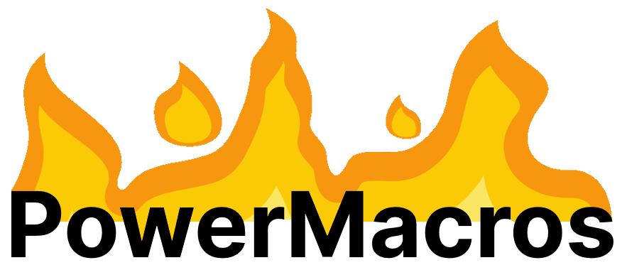

<p align="center">
  
</p>

# About <a href="https://www.rust-lang.org/"></a>

**UW's PowerMacros** is a Windows program that empowers the user with various *niche* macros that do very specific, powerful and magic things. It relies on [AutoHotkey](https://www.autohotkey.com/).

For now, it contains these 3 macros:

- **SudoF4**: forcefully close the current window via `Win + F4`, bypassing `Alt + F4` hooks ([read more here](https://github.com/UnexomWid/SudoF4)) 
- **ZenMode**: mute everything except the focused window and system sounds via `Win + F2`
- **Unified Enter**: remap numpad enter to normal enter

# Installation

You first need to install [Rust](https://www.rust-lang.org/) and [AutoHotkey v2](https://www.autohotkey.com/).

Then clone PowerMacros:

```sh
git clone https://github.com/UnexomWid/PowerMacros
```

# Usage

Just run `start.bat` from this repo.

```sh
cd <path_to_powermacros_repo>

start.bat
```

That's it. Keep it running in the background.

# Customizing

## Macros

PowerMacros relies on AutoHotkey. Simply modify the `uwpm.ahk` file to add/remove/edit macros. See the [AHK v2 docs](https://www.autohotkey.com/docs/v2/) if you're not familiar with the syntax.

ZenMode also relies on the Rust program, which is automatically executed via `start.bat`.
It won't work if you just use the AHK script separately.

## Sounds

Create the `assets/` dir inside the repo folder (near `uwpm.ahk`), since that's where the sound files will be stored. Here are the current sounds:

- `SudoF4.wav`: SudoF4 killed the current window
- `Zen_engage.ogg`: ZenMode was engaged
- `Zen_disengage.ogg`: ZenMode was disengaged

# License <a href="https://github.com/UnexomWid/PowerMacros/blob/master/LICENSE"></a>

**PowerMacros** was created by [UnexomWid](https://uw.exom.dev). It is licensed under [MIT](https://github.com/UnexomWid/PowerMacros/blob/master/LICENSE-MIT) OR [Apache 2](https://github.com/UnexomWid/PowerMacros/blob/master/LICENSE-APACHE).